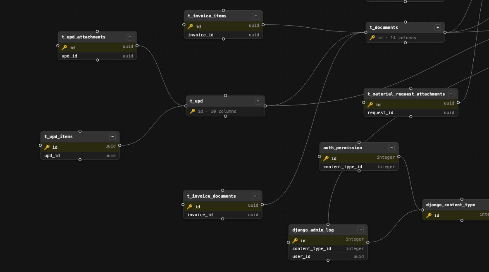
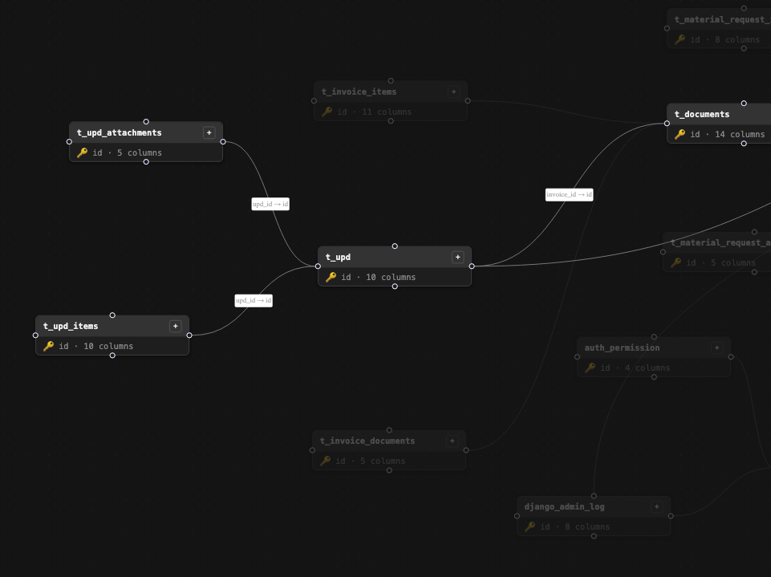
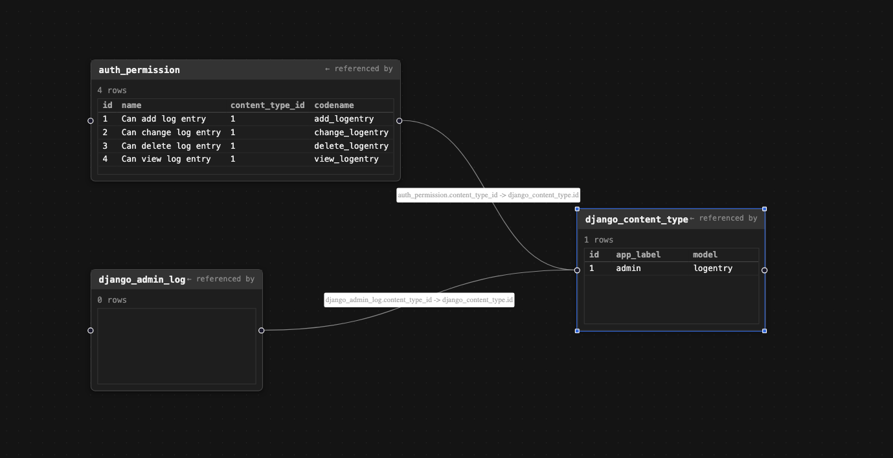

# db-visualizer

[English](README.md) | [日本語](README.ja.md)

**db-visualizer** is a free, open-source, self-hosted tool for visualizing a
PostgreSQL database. Point it at a connection string and it turns your
schema into an interactive **ER diagram** (entity-relationship diagram) and
lets you browse and follow **foreign-key relationships** row by row — no
config beyond `DATABASE_URL`, and no writes ever touch your database.

If you've searched for a *Postgres schema visualizer*, an *ER diagram
generator*, a *database relationship graph tool*, or a lightweight
*self-hosted alternative to pgAdmin's ERD view / DbSchema / SchemaSpy*,
this is that tool.

[](LICENSE)
[](https://www.postgresql.org/)
[](https://nodejs.org/)
[](#contributing)

## Table of contents

- [Features](#features)
- [Screenshots](#screenshots)
- [Requirements](#requirements)
- [Run it](#run-it)
- [Local dev (without Docker)](#local-dev-without-docker)
- [How it works](#how-it-works)
- [Security model](#security-model)
- [Current scope / known limitations](#current-scope--known-limitations)
- [FAQ](#faq)
- [Contributing](#contributing)
- [License](#license)

## Features

1. **Whole-database ER diagram** — every table, its columns, and
   foreign-key relationships, rendered as a draggable, zoomable graph.
   Switch between collapsed, keys-only, and all-columns views. Click a
   table to browse its rows.
2. **Linked-data diagram** — pick a row, and it draws a graph of that row
   plus every row in directly-linked tables (one hop out, both directions
   along foreign keys) — a live, row-level view of how your data connects.
   Each linked table is paginated and has a "custom query" button to scope
   it to specific columns/rows.
3. **Persisted layout** — node positions you drag are saved to
   `localStorage`, so your layout survives page reloads.
4. **Read-only by construction** — every query, including custom ones,
   runs inside a `READ ONLY` Postgres transaction. See
   [Security model](#security-model).

## Screenshots







## Requirements

- A Postgres database you want to explore (only Postgres is supported —
  introspection is done via `information_schema`).
- Docker, **or** Node.js 20+ for local dev without Docker.

## Run it

```bash
cp .env.example .env   # then edit DATABASE_URL
docker-compose up --build
```

Open http://localhost:4000.

If your Postgres is also running in Docker on the same machine, use
`host.docker.internal` instead of `localhost` in `DATABASE_URL`.

### Local dev (without Docker)

```bash
npm install
npm start                                  # API server on :4000

# in a second terminal
cd client && npm install && npm run dev    # Vite dev server on :5173, proxies /api -> :4000
```

There is no lint or test setup in this repo currently.

## How it works

- **Server** (`server/`) — a small Express API. `db.js` is the only place
  that touches Postgres; every query runs inside a `BEGIN TRANSACTION READ
  ONLY` with a 5s statement timeout. `routes/schema.js` introspects
  `information_schema` for tables/columns/foreign keys. `routes/data.js`
  handles row fetching, the custom-query endpoint, and one-hop linked-row
  lookups.
- **Client** (`client/`) — React + Vite, laid out with
  [React Flow](https://reactflow.dev/) and either
  [dagre](https://github.com/dagrejs/dagre) or
  [elkjs](https://github.com/kieler/elkjs) for auto-layout. No router — a
  simple three-mode state machine (`schema` → `pickRow` → `data`) in
  `App.jsx`.

```
server/           Express API (schema introspection, row queries, linked lookup)
client/           React + React Flow frontend (Vite)
Dockerfile        Multi-stage build: client build -> server runtime, single image
docker-compose.yml
```

## Security model

This tool is **read-only by construction, not by convention**:

- Every query, including user-typed custom queries, runs inside a
  `READ ONLY` Postgres transaction — nothing this tool does can mutate the
  target database.
- Table/column names from the client are whitelisted against
  `^[a-zA-Z_][a-zA-Z0-9_]*$` before being interpolated into SQL (they can't
  be parameterized like values can).
- The custom-query endpoint additionally restricts input to a single
  standalone `SELECT` statement (no semicolons, must start with `select`).

As defense in depth, **connect with a read-only Postgres role** rather than
a full-access one whenever possible.

## Current scope / known limitations

- **Postgres only.** Other databases (MySQL, SQLite, MongoDB, etc.) aren't
  supported.
- **Linked-data traversal is one hop only** from the selected row (tables
  it references, and tables that reference it). Multi-hop traversal is a
  natural next step but isn't implemented — row-level FK graphs explode
  fast beyond one hop, so it needs a deliberate depth control.
- No authentication — this is a local/trusted-environment tool, not
  designed to be exposed publicly.

## FAQ

**What is db-visualizer?**
A self-hosted web app that generates an interactive ER diagram from a live
PostgreSQL database and lets you click through rows along foreign-key
relationships, instead of hand-drawing a schema diagram or scrolling
through `psql \d` output.

**Is it safe to point at a production database?**
Every query runs in a Postgres `READ ONLY` transaction with a statement
timeout, including the custom-query feature — see
[Security model](#security-model). That said, for anything you care about,
connect with a read-only Postgres role as an extra layer, and be mindful
of query load on a live production instance.

**Does it support MySQL, SQLite, or other databases?**
Not currently — schema introspection is built on Postgres's
`information_schema` and `pg` client library specifically.

**How is this different from pgAdmin's ERD tool, DBeaver, or SchemaSpy?**
Those are general-purpose database clients/admin tools with ERD views
bolted on. db-visualizer does one thing: a fast, read-only, row-linked
visual explorer you can spin up with `docker-compose up` and no database
client installation.

## Contributing

Issues and PRs are welcome. This is a small, single-purpose tool — please
keep additions in the spirit of "read-only exploration," and preserve all
three layers of the security model above if you touch query-building code.

## License

[MIT](LICENSE)
